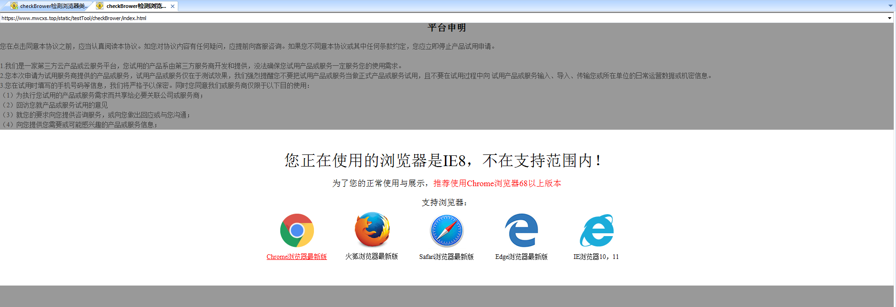
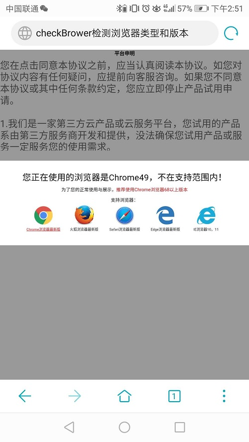

# checkbrower
checkbrower是一个检测当前环境的是PC端还是无线端，浏览器类型和版本号的插件

# 使用
## 1.1 本地引入封装的js文件

checkbrower.js是必须要引入的

第一步：获取组件方式：git clone https://github.com/saucxs/checkbrower.git

第二步：clone后，在需要加水印的相关页面引入水印文件"checkbrower.js":

```
<script src="./checkbrower.js"></script>
```
         
第三步：调用browserCheck方法:
```引入
//获取浏览器检测对象currentBrowser，包含browser，version，mobile，这三个参数
//brower代表的是浏览器的类型：值为Chrome，Firefox，IE，Safari等；version代表的是浏览器的版本，值为数字；mobile代表的是是否是无线端（手机端）浏览器，值为true，false
var currentBrowser = browserCheck();
 if (currentBrowser.mobile) {
      // 显示“暂不支持移动端访问，请用PC访问”
    } else if( (currentBrowser.browser == "Chrome" && currentBrowser.version < 68) ||
      (currentBrowser.browser == "Firefox" && currentBrowser.version < 60) ||
      (currentBrowser.browser == "IE" && currentBrowser.version < 10) ||
      (currentBrowser.browser == "Safari" && currentBrowser.version < 11)
    ){
      // 显示“当前浏览器的类型（currentBrowser.browser）和版本（currentBrowser.version）”
    } else{
      //支持的浏览器类型，正常显示
    }
```

## 1.2 npm包引入
```js
npm i --save check-brower
```
在需要的页面
```js
import checkBrower from 'check-brower'

let currentBrowser = new checkBrower();
 if (currentBrowser.mobile) {
      // 显示“暂不支持移动端访问，请用PC访问”
    } else if( (currentBrowser.browser == "Chrome" && currentBrowser.version < 68) ||
      (currentBrowser.browser == "Firefox" && currentBrowser.version < 60) ||
      (currentBrowser.browser == "IE" && currentBrowser.version < 10) ||
      (currentBrowser.browser == "Safari" && currentBrowser.version < 11)
    ){
      // 显示“当前浏览器的类型（currentBrowser.browser）和版本（currentBrowser.version）”
    } else{
      //支持的浏览器类型，正常显示
    }

```


# 使用栗子

查看地址：https://www.mwcxs.top/static/testTool/checkBrower/index.html

说明：

1、兼容到谷歌浏览器67及以上的，火狐浏览器59及以上，IE浏览器9及以上，Safari浏览器10及以上；

2、除了上述的范围的都会出现更换浏览器的提示

3、IE8的截图



4、android手机端截图




